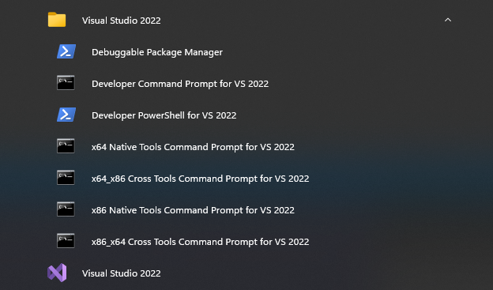

### 问题描述

如何分别在macOS、Windows、Linux系统上对OpenSSL源码进行编译？

### 问题解答

编译版本：`openssl-1.1.1t`

官方源码地址：https://www.openssl.org/source/

下面流程在三种系统上均进行实际验证，可放心食用。

- Windows(MSVC)

    基础资源：Visual Studio 编译器

    1. 安装`Perl`和`NASM`
    
        Perl 是一种流行的脚本语言，它在 OpenSSL 的编译过程中扮演了重要的角色。在 OpenSSL 的源代码中，有一些用 Perl 脚本编写的配置文件，这些文件会在编译过程中被解析并生成一些 C 语言代码。这些代码包含一些预处理指令，如条件编译语句和宏定义等，这些指令可以帮助 OpenSSL 在不同平台上进行编译和配置。

        NASM 是一种汇编语言编译器，它用于将 OpenSSL 的汇编语言代码编译成可执行的目标代码。在 OpenSSL 的源代码中，有一些用 NASM 编写的汇编语言代码，这些代码包含一些加密算法和哈希函数的实现。
    - Perl

        按需安装对应版本的strawberryperl，官网地址：https://strawberryperl.com/

    - NASM

        下载安装NASM，并将其安装位置**添加到环境变量Path**中，官网地址：https://www.nasm.us/

        上述步骤完成后新建cmd执行以下命令确认Perl和NASM环境没问题
        ```` bash
        perl --version
        ````
        ````
        This is perl 5, version 32, subversion 1 (v5.32.1) built for MSWin32-x64-multi-thread

        Copyright 1987-2021, Larry Wall

        Perl may be copied only under the terms of either the Artistic License or the
        GNU General Public License, which may be found in the Perl 5 source kit.

        Complete documentation for Perl, including FAQ lists, should be found on
        this system using "man perl" or "perldoc perl".  If you have access to the
        Internet, point your browser at http://www.perl.org/, the Perl Home Page.
        ````
        ```` bash
        nasm --version
        ````
        ````
        NASM version 2.16.01 compiled on Dec 21 2022
        ````
    2. 编译源码

        测试源码路径为：`E:\openssl-1.1.1t`

        - 在开始菜单打开Visual Studio安装自带的命令行工具，根据需要编译的库文件版本自行选择，如：

            

        - 配置编译选项

            `perl Configure` 是 OpenSSL 编译过程中的一个脚本，它用于根据不同的平台和编译器生成 Makefile 文件，并配置 OpenSSL 编译选项，如编译器选项、库选项、安装路径等。

            ```` bash
            cd /d E:\openssl-1.1.1t
            mkdir release
            perl Configure VC-WIN64A --prefix=E:\openssl-1.1.1t\release shared /MT /MP
            ````
            以下是各个参数的含义：

            `VC-WIN64A`: 指定使用 Visual Studio 编译器生成 64 位代码，如果需要编译 32 位代码则须指定为 `VC-WIN32`

            `--prefix=E:\openssl-1.1.1t\release`: 指定安装目录为当前目录下的 `E:\openssl-1.1.1t\release` 文件夹，注意：这个参数**必须为全路径**，不能为相对路径

            `shared`: 生成共享库，如果需要生成静态库须替换为`no-shared`

            `/MT`: 指定使用`多线程静态运行时库`。若指定使用`多线程动态运行时库`则改为`/MD`

            `/MP`: 启用并行编译。
        - 编译
            ```` bash
            nmake
            ````
        - 测试
            ```` bash
            nmake test
            ````
        - 安装
            ```` bash
            nmake install
            ````
            执行完成后库文件和头文件在--prefix参数指定的目录

- macOS
- Linux(Ubuntu-22.10)
