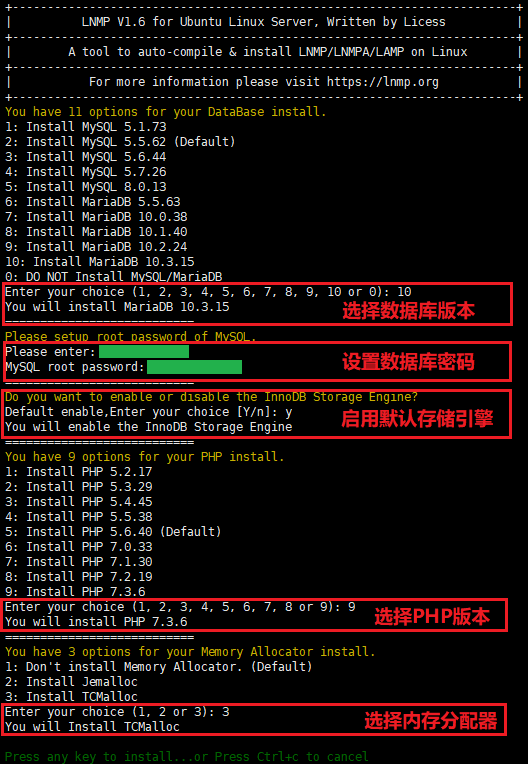
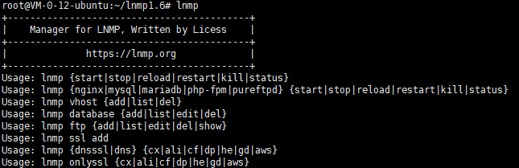
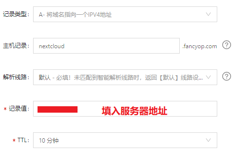
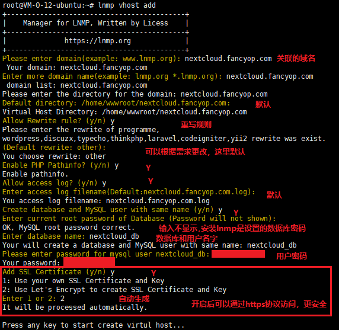
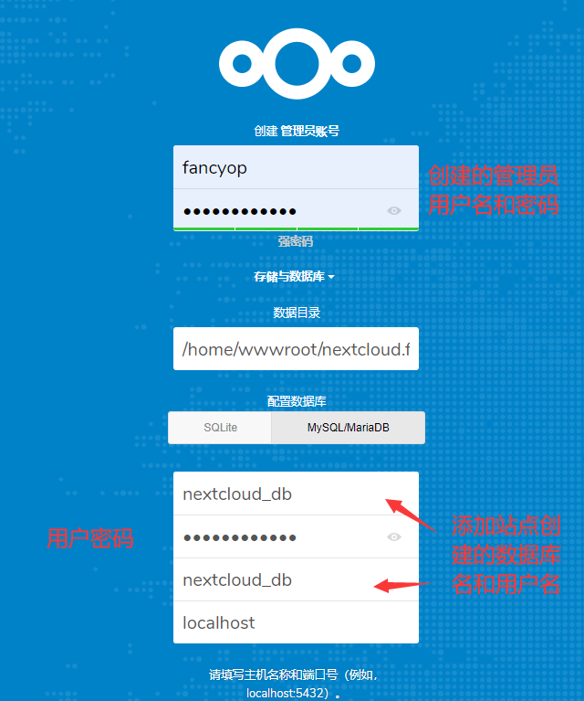
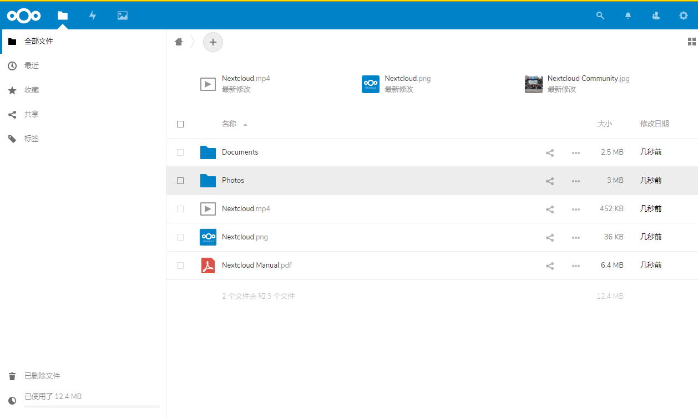

# 小白搭建私人网盘LNMP1.6 + Nextcloud-16

#### 操作系统：ubuntu18.04LTS

#### 服务器配置： 1核 2GB 1Mbps

搭建Nextcloud找了很多教程，有许许多多的不同的搭建方法，但是期间碰到了各种莫名奇妙的问题，小白一枚建站方面根本就是一窍不通，让我搞些 Nginx、PHP、MySQL、 Apache一个个安装配置实在是难为我了 :cry: 最后终于在摸爬滚打中找到了自认为还算简单的搭建方法。

## 第一步：搭建LNMP环境

搭建LNMP环境会比较久（lnmp1.5大概30分钟左右，lnmp1.6需要更久），建议使用screen独立运行会话终端（没有需自行安装yum install screen）

```bash
screen -S lnmp
```

然后下载lnmp一键安装包到本地

```bash
wget http://soft.vpser.net/lnmp/lnmp1.6.tar.gz -cO lnmp1.6.tar.gz
```

再解压lnmp安装包

```bash
tar zxvf lnmp1.6.tar.gz
```

最后进行安装

```bash
cd lnmp1.6
./install.sh lnmp
```

##### 注意：该一键安装包可以根据需要选择安装的模式（lnmp,lnmpa,lamp）

##### 【上面三部可以合并一步，按上面操作到此处可忽略此步】合并命令如：

```bash
wget http://soft.vpser.net/lnmp/lnmp1.6.tar.gz -cO lnmp1.6.tar.gz && tar zxf lnmp1.6.tar.gz && cd lnmp1.6 && ./install.sh lnmp
```

根据实际需要一步步安装（于nextcloud而言，其不同版本对PHP及数据库要求最低版本会有不同）

【注意】1GB内存不能安装MySQL 8.0或者MariaDB 10.3以上版本



安装完成后执行lnmp命令如：



浏览器直接打开服务器ip地址会显示安装完成的默认页面

## 第二步：添加域名解析记录

如阿里云需要到【域名解析设置】里进行配置：



## 第三步：服务器添加并关联域名站点

添加站点命令

```bash
lnmp vhost add
```



等待10~20s完成

## 第四步：下载配置nextcloud

下载nextcloud-16，其他版本：[nextcloud](https://nextcloud.com/changelog/)

```bash
wget https://download.nextcloud.com/server/releases/nextcloud-16.0.8.zip
```

解压离线包

```bash
unzip nextcloud-16.0.8.zip
```

将解压后的文件移动到添加的域名站点目录

```bash
root@VM-0-12-ubuntu:~# mv nextcloud/* /home/wwwroot/nextcloud.fancyop.com/
root@VM-0-12-ubuntu:~# ll nextcloud
total 16
drwxr-xr-x 2 root root 4096 Feb 26 01:19 ./
drwx------ 8 root root 4096 Feb 26 01:16 ../
-rw-r--r-- 1 root root 2388 Jan 30 05:15 .htaccess
-rw-r--r-- 1 root root  101 Jan 30 05:15 .user.ini
```

【特别重要！！！】查看目录发现mv操作后有两个文件并没有移动，然后单独移动.htaccess文件，.user.ini文件可以不需要，在添加好站点时会自动生成.user.ini

```bash
mv nextcloud/.htaccess /home/wwwroot/nextcloud.fancyop.com/
```

打开网址nextcloud.fancyop.com，出现错误，如：


这是因为直接解压后的文件的组权限和用户权限没有分配正确，需要任意地方新建一个sh文件

```bash
vi permission.sh
```

文件内容（第二行以实际路径为准）：

```bash
#!/bin/bash
ocpath='/home/wwwroot/nextcloud.fancyop.com/'
htuser='www'
htgroup='www'
rootuser='root'
 
printf "Creating possible missing Directories\n"
mkdir -p $ocpath/data
mkdir -p $ocpath/assets
mkdir -p $ocpath/updater
 
printf "chmod Files and Directories\n"
find ${ocpath}/ -type f -print0 | xargs -0 chmod 0640
find ${ocpath}/ -type d -print0 | xargs -0 chmod 0750
 
printf "chown Directories\n"
chown -R ${rootuser}:${htgroup} ${ocpath}/
chown -R ${htuser}:${htgroup} ${ocpath}/apps/
chown -R ${htuser}:${htgroup} ${ocpath}/assets/
chown -R ${htuser}:${htgroup} ${ocpath}/config/
chown -R ${htuser}:${htgroup} ${ocpath}/data/
chown -R ${htuser}:${htgroup} ${ocpath}/themes/
chown -R ${htuser}:${htgroup} ${ocpath}/updater/
 
chmod +x ${ocpath}/occ
 
printf "chmod/chown .htaccess\n"
if [ -f ${ocpath}/.htaccess ]
      then
      chmod 0644 ${ocpath}/.htaccess
      chown ${rootuser}:${htgroup} ${ocpath}/.htaccess
fi
if [ -f ${ocpath}/data/.htaccess ]
      then
      chmod 0644 ${ocpath}/data/.htaccess
      chown ${rootuser}:${htgroup} ${ocpath}/data/.htaccess
fi
```

执行文件

```bash
sh permission.sh
```

刷新网址网址nextcloud.fancyop.com，安装下图类似配置



点击完成，等一会就大功告成！后续可以安装手机端，PC端进行文件同步

